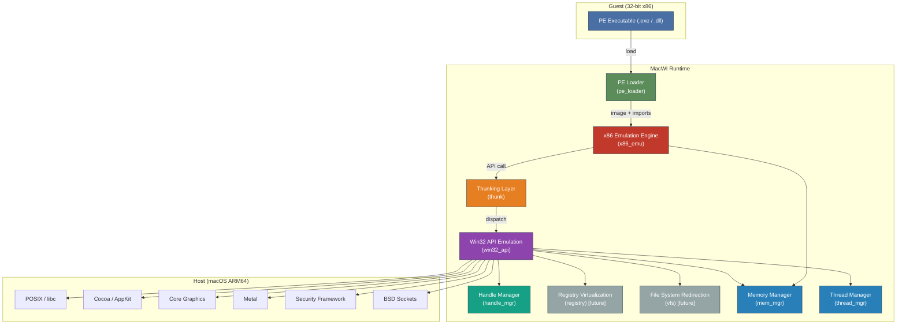
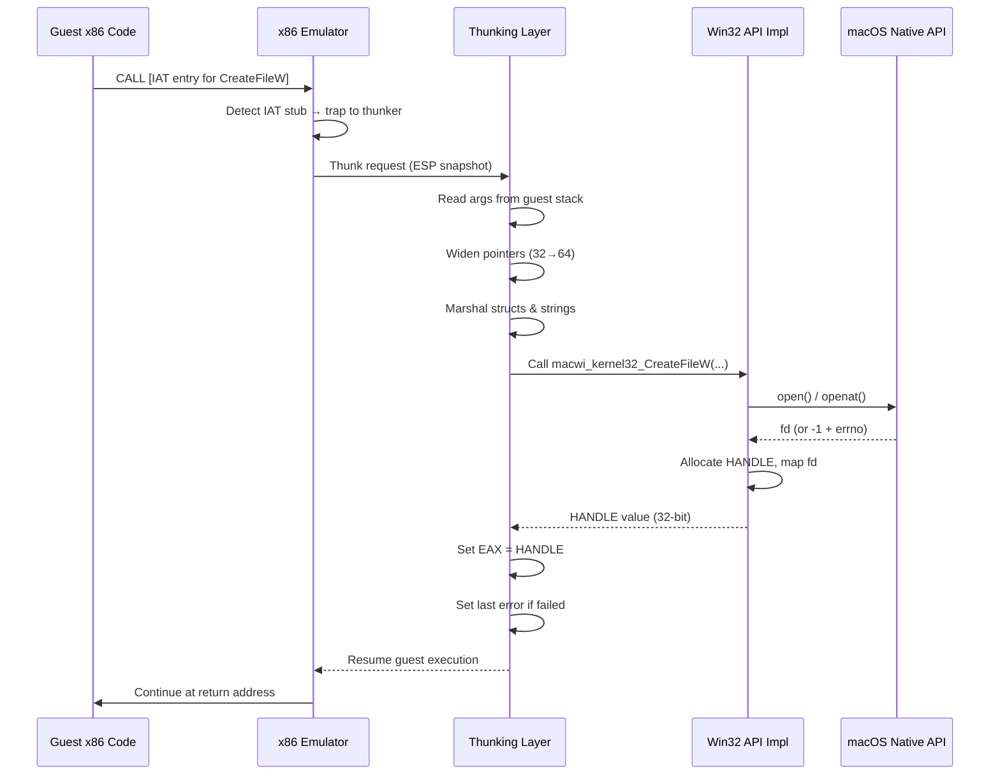

# MacWI — Architecture Overview

> **Version:** 0.1.0-draft  
> **Last Updated:** 2026-06-24  
> **Status:** Living Document — updated as the implementation evolves

---

## Table of Contents

1. [Project Overview](#1-project-overview)
2. [Design Principles](#2-design-principles)
3. [Architecture Layers](#3-architecture-layers)
4. [Component Diagram](#4-component-diagram)
5. [Memory Model](#5-memory-model)
6. [Threading Model](#6-threading-model)
7. [API Translation Strategy](#7-api-translation-strategy)
8. [Build System](#8-build-system)
9. [Testing Strategy](#9-testing-strategy)
10. [Future Work](#10-future-work)
11. [References](#11-references)

---

## 1. Project Overview

**MacWI** (_Mac Windows Interop_) is a **user-mode compatibility layer** that
enables 32-bit Windows (x86) applications to run on **Apple Silicon (ARM64)
macOS** — conceptually similar to Microsoft's WoW64 subsystem, but targeting an
entirely different host platform and ISA.

### Goals

| Goal | Description |
|------|-------------|
| **Binary compatibility** | Load and execute unmodified 32-bit Windows PE executables (.exe / .dll). |
| **User-mode only** | No kernel extensions, no hypervisor — runs as a regular macOS process. |
| **Progressive fidelity** | Start with a minimal Win32 API surface and expand incrementally. |
| **Performance** | Move from interpretation to JIT dynamic recompilation over time. |
| **Developer experience** | Clean C11 codebase, modular architecture, comprehensive tests. |

### Non-Goals

- Running 64-bit Windows applications (PE32+ / x86-64). This may be explored in a future project.
- Full NT kernel emulation. MacWI targets the Win32 API surface, not the NT syscall interface.
- GPU passthrough or DirectX 12 Ultimate support (initial scope covers GDI and basic Direct3D via Metal translation).

---

## 2. Design Principles

1. **Modularity** — Every subsystem is a self-contained module behind a clean C
   API. Modules communicate through well-defined interfaces, never through
   shared global state.

2. **Layered Translation** — The system is organized as a pipeline:
   `PE binary → load → emulate → thunk → native call → result back-propagation`.
   Each stage is independently testable.

3. **Fail-Fast with Diagnostics** — Unimplemented APIs return
   `MACWI_STATUS_NOT_IMPLEMENTED` with a diagnostic log entry rather than
   silently succeeding. This makes it easy to identify the next API to
   implement for a given application.

4. **Convention over Configuration** — Sensible defaults for memory layout,
   stack sizes, and locale settings. Power users can override via environment
   variables or a configuration file.

5. **Consistent Naming** — Public API uses the `macwi_` prefix. Internal
   (translation-unit-scoped) functions use the `internal_` prefix. Types end
   with `_t`, callbacks with `_fn`.

---

## 3. Architecture Layers

The system is composed of seven major layers, each described in detail below.

### 3.1 PE Loader (`pe_loader`)

The PE Loader is responsible for transforming a static PE binary on disk into a
runnable in-memory image within the emulated 32-bit address space.

#### Responsibilities

- **DOS / PE header parsing** — Validate `IMAGE_DOS_HEADER`, locate the PE
  signature, and parse `IMAGE_NT_HEADERS32` including
  `IMAGE_OPTIONAL_HEADER32`.
- **Section mapping** — Iterate `IMAGE_SECTION_HEADER` entries and map each
  section (`.text`, `.data`, `.rdata`, `.rsrc`, `.reloc`, etc.) into the
  emulated address space with the correct permissions (RX, RW, RO).
- **Base relocation** — If the image cannot be loaded at its preferred
  `ImageBase`, apply all relocation entries (`IMAGE_BASE_RELOCATION` blocks)
  to fix up absolute addresses.
- **Import resolution** — Walk the Import Directory Table
  (`IMAGE_IMPORT_DESCRIPTOR`), resolve each imported DLL, and patch the Import
  Address Table (IAT) with pointers to MacWI's API emulation stubs.
- **TLS initialization** — Parse the TLS Directory
  (`IMAGE_TLS_DIRECTORY32`) and set up thread-local storage slots and
  callbacks.
- **Entry point extraction** — Return the virtual address of
  `AddressOfEntryPoint` for the emulation engine to begin execution.

#### Key Data Structures

```c
typedef struct macwi_pe_image {
    uint32_t                image_base;      /* Actual load address (guest VA) */
    uint32_t                image_size;      /* SizeOfImage from optional header */
    uint32_t                entry_point;     /* Guest VA of entry point */
    macwi_section_t        *sections;        /* Array of mapped sections */
    uint32_t                section_count;
    macwi_import_table_t   *imports;         /* Resolved import table */
    macwi_reloc_table_t    *relocs;          /* Relocation data (if rebased) */
} macwi_pe_image_t;
```

#### Error Handling

All loader functions return `macwi_status_t`. Critical failures (corrupt
headers, unsupported machine type) are fatal. Non-critical issues (missing
optional directories) emit warnings and continue.

---

### 3.2 x86 Emulation Engine (`x86_emu`)

The emulation engine is the heart of MacWI. It fetches, decodes, and executes
x86 instructions within the emulated 32-bit address space.

#### Execution Modes

| Mode | Status | Description |
|------|--------|-------------|
| **Interpreter** | ✅ Active | Fetch-decode-execute loop. Accurate but slow (~50–200× overhead). Used as the reference implementation and fallback. |
| **JIT (Dynamic Recompilation)** | 🔜 Planned | Translates basic blocks of x86 → ARM64 machine code at runtime. Cached in a code cache. Target: <5× overhead for compute-bound code. |
| **Hybrid** | 🔜 Planned | Hot paths are JIT-compiled; cold/complex paths fall back to the interpreter. Self-modifying code invalidates the code cache. |

#### CPU State

The emulated CPU state is maintained in a structure that mirrors the IA-32
register file:

```c
typedef struct macwi_x86_cpu {
    /* General-purpose registers */
    uint32_t eax, ebx, ecx, edx;
    uint32_t esi, edi, ebp, esp;

    /* Instruction pointer */
    uint32_t eip;

    /* Flags register (CF, ZF, SF, OF, etc.) */
    uint32_t eflags;

    /* Segment registers (flat model — mostly informational) */
    uint16_t cs, ds, es, fs, gs, ss;

    /* FPU / SSE state */
    macwi_x87_state_t   fpu;
    macwi_sse_state_t   sse;

    /* Descriptor tables (minimal — enough for flat model) */
    macwi_descriptor_t  gdt[8192];
    macwi_descriptor_t  ldt[8192];
    macwi_descriptor_t  idt[256];
} macwi_x86_cpu_t;
```

#### Instruction Decoding

Decoding follows the Intel x86 variable-length instruction format:

1. **Prefix bytes** — REP, LOCK, segment overrides, operand-size override.
2. **Opcode** — 1, 2, or 3 bytes (with `0x0F` and `0x0F 0x38/0x3A` escape).
3. **ModR/M + SIB** — Addressing mode resolution.
4. **Displacement + Immediate** — Variable-size operands.

Decoded instructions are represented as:

```c
typedef struct macwi_x86_instr {
    uint8_t         opcode[3];
    uint8_t         opcode_len;
    uint8_t         prefixes;       /* Bitmask of active prefixes */
    macwi_operand_t operands[3];    /* Up to 3 operands */
    uint8_t         operand_count;
    uint8_t         total_length;   /* Total instruction length in bytes */
} macwi_x86_instr_t;
```

#### Interpreter Loop (Simplified)

```
while (cpu->running) {
    instr = decode(cpu->eip, guest_memory);
    execute(cpu, instr);
    cpu->eip += instr.total_length;    // (branches override this)
    check_interrupts(cpu);
}
```

#### Future: JIT Compilation Pipeline

```
x86 bytes → Decode → IR (intermediate) → Optimize → ARM64 codegen → Code cache
                                              ↑
                                    Constant folding,
                                    dead flag elimination,
                                    register allocation
```

---

### 3.3 Thunking Layer (`thunk`)

The thunking layer is the **bridge** between the emulated 32-bit x86 world and
the native 64-bit ARM64 host. Every Win32 API call made by the guest crosses
this boundary.

#### Responsibilities

| Task | Details |
|------|---------|
| **Calling convention adaptation** | Convert x86 `__stdcall` / `__cdecl` (stack-based arguments) to ARM64 AAPCS (register-based: x0–x7 for integers, d0–d7 for floats). |
| **Pointer widening** | Guest 32-bit pointers → host 64-bit pointers. Requires mapping through the address translation table. |
| **Pointer narrowing** | Host 64-bit pointers returned to the guest must be representable in 32 bits (ensured by the memory model). |
| **Struct marshaling** | Many Win32 structs differ in layout between 32-bit and 64-bit due to alignment and pointer sizes. The thunking layer packs/unpacks these. |
| **String conversion** | Wide strings (`LPCWSTR`, UTF-16LE) ↔ macOS native strings (UTF-8). |
| **Return value propagation** | Translate host return values and set `SetLastError` / `errno` as appropriate. |

#### Thunk Descriptor

Each thunked API is described by a static descriptor:

```c
typedef struct macwi_thunk_desc {
    const char          *api_name;          /* e.g. "CreateFileW" */
    macwi_thunk_fn       thunk_func;        /* Native implementation */
    uint8_t              param_count;        /* Number of parameters */
    macwi_param_type_t   param_types[16];   /* PARAM_UINT32, PARAM_PTR, ... */
    macwi_call_conv_t    call_conv;         /* STDCALL or CDECL */
} macwi_thunk_desc_t;
```

#### Stack Frame Translation

```
   x86 (guest) stack           ARM64 (host) registers
  ┌──────────────────┐
  │  arg_n  (32-bit) │  ───►   x0..x7  (64-bit, zero/sign extended)
  │  ...             │         (spill to host stack if > 8 args)
  │  arg_1  (32-bit) │
  │  ret addr        │  ───►   saved, restored after thunk returns
  └──────────────────┘
```

---

### 3.4 Win32 API Emulation (`win32_api`)

This layer re-implements the Windows API surface by mapping Win32 calls to
their macOS equivalents.

#### DLL Modules

| Emulated DLL | Primary macOS Backend | Scope |
|---|---|---|
| `kernel32.dll` | POSIX (`open`, `read`, `mmap`, `pthread_*`), libdispatch | File I/O, memory, threads, synchronization, console |
| `ntdll.dll` | Internal implementation | NT-layer primitives (`NtCreateFile`, heap, RTL utilities) |
| `user32.dll` | Cocoa (AppKit) | Window management, message loop, input |
| `gdi32.dll` | Core Graphics, Core Text | 2D rendering, fonts, device contexts |
| `advapi32.dll` | Security framework, file I/O | Registry, security tokens, crypto |
| `ws2_32.dll` | BSD sockets | Winsock networking |
| `msvcrt.dll` | libc | C runtime (malloc, printf, math) |
| `shell32.dll` | NSWorkspace, FileManager | Shell operations, file associations |
| `ole32.dll` / `oleaut32.dll` | Internal COM runtime | COM/OLE basics |

#### Module Registration

Emulated DLLs are registered in a global dispatch table at startup:

```c
typedef struct macwi_dll_module {
    const char              *name;          /* "kernel32.dll" */
    macwi_thunk_desc_t      *exports;       /* Array of exported API thunks */
    uint32_t                 export_count;
    macwi_status_t         (*init_fn)(void);   /* Module initializer */
    void                   (*fini_fn)(void);   /* Module finalizer */
} macwi_dll_module_t;
```

#### Implementation Priority

The implementation follows a demand-driven approach:

1. **Phase 1 — Bootstrapping**: `kernel32` core (file I/O, memory, heap), `ntdll` basics, `msvcrt` essentials. Enough to run simple console apps. (✅ **Completed**)
2. **Phase 2 — Console Applications**: Full `kernel32` (Threading, Mutexes, VFS), `advapi32` registry stubs, `ws2_32` networking. (⏳ **In Progress**)
3. **Phase 3 — GUI Applications**: `user32` windowing + message pump, `gdi32` basic rendering.
4. **Phase 4 — Rich Applications**: COM runtime, shell integration, advanced GDI, theming.

---

### 3.5 Handle Management (`handle_mgr`)

Windows objects (files, threads, mutexes, events, registry keys) are
identified by opaque `HANDLE` values. MacWI maintains a centralized handle
table that maps these to native macOS resources.

#### Design

```c
typedef enum macwi_handle_type {
    HANDLE_TYPE_FILE,
    HANDLE_TYPE_THREAD,
    HANDLE_TYPE_MUTEX,
    HANDLE_TYPE_EVENT,
    HANDLE_TYPE_SEMAPHORE,
    HANDLE_TYPE_PROCESS,
    HANDLE_TYPE_REG_KEY,
    HANDLE_TYPE_FIND_FILE,
    HANDLE_TYPE_MAPPING,
    HANDLE_TYPE_TIMER,
    /* ... */
} macwi_handle_type_t;

typedef struct macwi_handle_entry {
    macwi_handle_type_t  type;
    uint32_t             ref_count;     /* Reference counting for DuplicateHandle */
    uint32_t             access_mask;   /* Granted access rights */
    union {
        int              fd;            /* POSIX file descriptor */
        pthread_t        thread;        /* Native thread */
        pthread_mutex_t *mutex;         /* Native mutex */
        pthread_cond_t  *cond;          /* Native condition variable */
        void            *opaque;        /* Generic pointer */
    } native;
} macwi_handle_entry_t;
```

#### Handle Allocation

- Handles are allocated from a **dense array** with a free-list for O(1)
  allocation and deallocation.
- The returned `HANDLE` value is `(index << 2) | 0x4` — the shift and OR
  ensure handles are never zero or aligned to common sentinel values like
  `INVALID_HANDLE_VALUE` (0xFFFFFFFF).
- `CloseHandle()` decrements the reference count; the entry is freed when it
  reaches zero.
- Thread-safe: all handle table operations are protected by a `pthread_rwlock`.

#### Special Handles

| Win32 Handle | MacWI Mapping |
|---|---|
| `INVALID_HANDLE_VALUE` (−1) | Sentinel — never allocated |
| `GetStdHandle(STD_INPUT_HANDLE)` | `fd = STDIN_FILENO` |
| `GetStdHandle(STD_OUTPUT_HANDLE)` | `fd = STDOUT_FILENO` |
| `GetStdHandle(STD_ERROR_HANDLE)` | `fd = STDERR_FILENO` |
| `GetCurrentProcess()` | Pseudo-handle → self |
| `GetCurrentThread()` | Pseudo-handle → calling thread |

---

### 3.6 Registry Virtualization (`registry`) — _Future_

A file-backed emulation of the Windows Registry, providing the `HKEY` tree
structure that many Windows applications depend on.

#### Design Goals

- **Persistent storage** — Registry hives stored as SQLite databases or
  memory-mapped flat files under `~/.macwi/registry/`.
- **View separation** — Support `KEY_WOW64_32KEY` and `KEY_WOW64_64KEY` flags
  for 32/64-bit registry view redirection.
- **Pre-populated hives** — Ship default values for
  `HKEY_LOCAL_MACHINE\SOFTWARE\Microsoft\Windows NT\CurrentVersion` and other
  commonly-queried keys.
- **Transactional writes** — Atomic commit semantics to prevent corruption.

---

### 3.7 Graphical Subsystem (User32/GDI32)
  - Native Cocoa (AppKit) `NSWindow` bridging to emulated `HWND` handles.
  - GUI calls from the background x86 emulator thread are dispatched synchronously (`dispatch_sync`) to the main thread where the Cocoa `NSRunLoop` processes them.
  - Event loop integration via a custom thread-safe event queue (`NSMutableArray`) and `[NSApp nextEventMatchingMask:]` non-blocking polling.
  - Emulation of Device Contexts (HDC) with translation to Cocoa `NSGraphicsContext` for primitives like `FillRect` and `TextOutA`.

### 3.8 File System Redirection (`vfs`) — _Future_

Maps Windows file paths to a virtual file system rooted under
`~/.macwi/drive_c/`.

#### Path Mapping Examples

| Windows Path | MacWI Host Path |
|---|---|
| `C:\` | `~/.macwi/drive_c/` |
| `C:\Windows\System32\` | `~/.macwi/drive_c/windows/system32/` |
| `C:\Users\<user>\` | `~/.macwi/drive_c/users/<macOS-username>/` |
| `\\.\NUL` | `/dev/null` |
| `\\.\COM1` | (not supported — returns error) |

#### Features

- Case-insensitive path lookup (backed by a trie or hash map).
- Automatic `\` → `/` separator conversion.
- Drive letter management (C: is default; additional drives can be configured).
- `GetSystemDirectory()`, `GetWindowsDirectory()` return correctly mapped paths.

---

## 4. Component Diagram



### Data Flow: API Call Lifecycle



---

## 5. Memory Model

### 5.1 Address Space Layout

MacWI simulates a 32-bit (4 GB) address space within the host 64-bit process.
A contiguous 4 GB region is reserved at startup using `mmap` with
`MAP_ANONYMOUS` as a sandbox for all guest memory.

```
Guest Address Space (0x00000000 – 0xFFFFFFFF)
┌──────────────────────────────────────────────────────┐
│ 0x00000000 – 0x0000FFFF  │ Null guard (unmapped)     │  ← Trap null derefs
├──────────────────────────────────────────────────────┤
│ 0x00010000 – 0x003FFFFF  │ PE image load area        │  ← Default ImageBase
├──────────────────────────────────────────────────────┤
│ 0x00400000 – 0x0FFFFFFF  │ Application code/data     │  ← Typical .exe base
├──────────────────────────────────────────────────────┤
│ 0x10000000 – 0x6FFFFFFF  │ DLL load area             │  ← Emulated DLLs
├──────────────────────────────────────────────────────┤
│ 0x70000000 – 0x7EFFFFFF  │ Shared / mapped regions   │  ← File mappings
├──────────────────────────────────────────────────────┤
│ 0x7F000000 – 0x7FFEFFFF  │ Thread stacks             │  ← Grows downward
├──────────────────────────────────────────────────────┤
│ 0x7FFF0000 – 0x7FFFFFFF  │ System info / PEB / TEB   │  ← Process/Thread env
├──────────────────────────────────────────────────────┤
│ 0x80000000 – 0xFFFFFFFF  │ Kernel space (unmapped)   │  ← Reserved, trap
└──────────────────────────────────────────────────────┘
```

### 5.2 Host-Guest Address Translation

```c
/*
 * guest_base: host virtual address where the 4 GB sandbox starts.
 * All guest VA → host VA translation is a simple addition.
 */
static uint8_t *guest_base = NULL;  /* Set during initialization */

static inline void *guest_to_host(uint32_t guest_va) {
    return guest_base + guest_va;
}

static inline uint32_t host_to_guest(const void *host_ptr) {
    return (uint32_t)((const uint8_t *)host_ptr - guest_base);
}
```

### 5.3 Memory Allocation Strategy

| Win32 API | MacWI Implementation |
|---|---|
| `VirtualAlloc` | `mmap(MAP_FIXED)` within guest sandbox |
| `VirtualFree` | `munmap` / `madvise(MADV_FREE)` |
| `VirtualProtect` | `mprotect` |
| `HeapCreate/HeapAlloc` | Custom allocator on top of `VirtualAlloc` |
| `GlobalAlloc/LocalAlloc` | Thin wrapper around `HeapAlloc` |
| `MapViewOfFile` | `mmap` with offset into guest region |

### 5.4 Memory Protection

macOS ARM64 enforces W^X (write XOR execute). Code pages in the guest sandbox
must use `pthread_jit_write_protect_np()` to toggle between writable and
executable states when performing JIT compilation or handling self-modifying
code.

---

## 6. Threading Model

### 6.1 Thread Mapping

Each Win32 thread created by the guest is backed by a native `pthread`:

```c
typedef struct macwi_thread {
    pthread_t            native_thread;    /* Host thread */
    macwi_x86_cpu_t      cpu;              /* Per-thread CPU state */
    uint32_t             stack_base;       /* Guest stack base (high address) */
    uint32_t             stack_size;       /* Guest stack size */
    uint32_t             tls_slots[64];    /* Win32 TLS slots (TlsAlloc) */
    uint32_t             teb_address;      /* Guest address of TEB */
    uint32_t             thread_id;        /* Win32 thread ID */
    HANDLE               win32_handle;     /* Handle table entry */
    macwi_thread_state_t state;            /* RUNNING, SUSPENDED, TERMINATED */
} macwi_thread_t;
```

### 6.2 Thread Creation Flow

```
CreateThread(NULL, 0, start_addr, param, 0, &tid)
  │
  ├─ Allocate guest stack (VirtualAlloc in guest space)
  ├─ Initialize CPU state (EIP = start_addr, ESP = stack_top)
  ├─ Set up TEB in guest memory
  ├─ Allocate HANDLE in handle table
  ├─ pthread_create() → macwi_thread_entry()
  │     └─ Enter emulation loop with per-thread CPU state
  └─ Return HANDLE to guest
```

### 6.3 Synchronization Primitives

| Win32 Primitive | MacWI Implementation | Notes |
|---|---|---|
| `CreateMutex` / `WaitForSingleObject` | `pthread_mutex_t` | Named mutexes use a shared registry |
| `CreateEvent` (auto/manual reset) | `pthread_cond_t` + `pthread_mutex_t` + flag | Manual-reset requires broadcast |
| `CreateSemaphore` | `dispatch_semaphore_t` | macOS dispatch semaphores for efficiency |
| `Critical Section` | `pthread_mutex_t` (non-recursive) or `os_unfair_lock` | `os_unfair_lock` for hot paths |
| `InitOnceExecuteOnce` | `pthread_once_t` | Direct mapping |
| `SRWLock` | `pthread_rwlock_t` | Reader-writer lock |
| `WaitForMultipleObjects` | `kqueue` + custom multiplexer | Complex — requires polling/signaling bridge |
| `Sleep` / `SleepEx` | `nanosleep` | Alertable sleeps use signal delivery |

### 6.4 Thread-Local Storage (TLS)

Two TLS mechanisms are emulated:

1. **Dynamic TLS** (`TlsAlloc` / `TlsSetValue` / `TlsGetValue`) — Backed by
   a per-thread array of 64 `uint32_t` slots (expandable).

2. **Static TLS** (PE `.tls` section) — Parsed by the PE Loader. Each new
   thread gets a copy of the TLS template data at thread creation time. The
   `FS` segment register (accessed via `FS:[offset]`) is emulated by
   maintaining a per-thread TEB pointer.

---

## 7. API Translation Strategy

### 7.1 Table-Driven Dispatch

Each emulated DLL registers its exported functions in a dispatch table. When
the guest calls an imported function, the emulator traps into the thunking
layer, which performs a lookup:

```c
/* Lookup chain:
 * 1. Hash the DLL name + function name (or ordinal).
 * 2. Search the dispatch table (open-addressing hash map).
 * 3. If found → call the thunk. If not → log + return ERROR_CALL_NOT_IMPLEMENTED.
 */
macwi_thunk_desc_t *macwi_dispatch_lookup(const char *dll_name,
                                           const char *func_name);

macwi_thunk_desc_t *macwi_dispatch_lookup_ordinal(const char *dll_name,
                                                    uint16_t ordinal);
```

### 7.2 Parameter Marshaling Pipeline

Each API call goes through a structured marshaling pipeline:

```
 ┌──────────┐    ┌──────────────┐    ┌──────────────┐    ┌──────────┐
 │ Read raw │    │ Type-convert │    │ Validate /   │    │ Call     │
 │ args from│───►│ & widen      │───►│ sanitize     │───►│ native   │
 │ guest    │    │ (32→64 bit)  │    │ pointers     │    │ impl     │
 │ stack    │    │              │    │              │    │          │
 └──────────┘    └──────────────┘    └──────────────┘    └──────────┘
                                                              │
 ┌──────────┐    ┌──────────────┐    ┌──────────────┐         │
 │ Write    │    │ Narrow &     │    │ Translate    │◄────────┘
 │ EAX /    │◄───│ marshal      │◄───│ error codes  │
 │ EDX:EAX  │    │ out-params   │    │ & results    │
 └──────────┘    └──────────────┘    └──────────────┘
```

### 7.3 Error Code Translation

MacWI maintains bidirectional mapping tables between three error code domains:

```
 NTSTATUS  ◄──►  Win32 Error Code  ◄──►  POSIX errno
 (32-bit)        (GetLastError)          (int)
```

Examples:

| NTSTATUS | Win32 Error | errno | Meaning |
|---|---|---|---|
| `STATUS_SUCCESS` (0x0) | `ERROR_SUCCESS` (0) | 0 | Success |
| `STATUS_NO_SUCH_FILE` (0xC000000F) | `ERROR_FILE_NOT_FOUND` (2) | `ENOENT` | File not found |
| `STATUS_ACCESS_DENIED` (0xC0000022) | `ERROR_ACCESS_DENIED` (5) | `EACCES` | Access denied |
| `STATUS_NO_MEMORY` (0xC0000017) | `ERROR_NOT_ENOUGH_MEMORY` (8) | `ENOMEM` | Out of memory |
| `STATUS_BUFFER_TOO_SMALL` (0xC0000023) | `ERROR_INSUFFICIENT_BUFFER` (122) | `ERANGE` | Buffer too small |

The translation is performed via a sorted lookup table with binary search,
falling back to a generic error code if no mapping exists.

---

## 8. Build System

### 8.1 CMake Configuration

MacWI uses **CMake 3.25+** as its build system, targeting **macOS ARM64** with
the **C11** standard.

```
macwi/
├── CMakeLists.txt              # Root build configuration
├── cmake/
│   ├── MacWIConfig.cmake       # Project-wide compile options
│   ├── AddModule.cmake         # Helper to add a MacWI module
│   └── FindFrameworks.cmake    # Locate macOS frameworks
├── src/
│   ├── core/                   # Core types, error codes, logging
│   ├── pe_loader/              # PE loading and parsing
│   ├── x86_emu/                # x86 emulation engine
│   ├── thunk/                  # Thunking layer
│   ├── win32_api/              # Win32 API implementations
│   │   ├── kernel32/
│   │   ├── ntdll/
│   │   ├── user32/
│   │   ├── gdi32/
│   │   └── ...
│   ├── handle_mgr/             # Handle table
│   ├── mem_mgr/                # Memory management
│   └── thread_mgr/             # Threading
├── include/
│   └── macwi/                  # Public headers
│       ├── macwi.h             # Umbrella header
│       ├── types.h             # Core types (macwi_status_t, etc.)
│       ├── pe_loader.h
│       ├── x86_emu.h
│       ├── thunk.h
│       ├── win32_api.h
│       ├── handle_mgr.h
│       └── ...
├── tests/
│   ├── unit/                   # Per-module unit tests
│   ├── integration/            # End-to-end with real PE binaries
│   └── fixtures/               # Test PE binaries, data files
├── docs/
│   └── architecture.md         # ← This document
└── tools/
    ├── pe_dump/                # Utility to dump PE headers
    └── api_coverage/           # Script to report API coverage
```

### 8.2 Compiler Requirements

| Requirement | Value |
|---|---|
| **Compiler** | Apple Clang 15+ (Xcode 15+) |
| **C Standard** | C11 (`-std=c11`) with POSIX extensions (`_POSIX_C_SOURCE=200809L`) |
| **Target Architecture** | `arm64-apple-macos14.0` |
| **Warnings** | `-Wall -Wextra -Wpedantic -Werror` in CI |
| **Sanitizers** | ASan + UBSan enabled for debug builds |

### 8.3 Build Commands

```bash
# Configure
cmake -B build -G Ninja \
      -DCMAKE_BUILD_TYPE=Debug \
      -DCMAKE_OSX_ARCHITECTURES=arm64

# Build
cmake --build build -j$(sysctl -n hw.ncpu)

# Run tests
ctest --test-dir build --output-on-failure

# Run a PE binary
./build/macwi path/to/application.exe
```

---

## 9. Testing Strategy

### 9.1 Test Pyramid

```
          ┌──────────────┐
          │  Wine Tests  │   ← Compatibility testing with existing
          │  (adapted)   │     Wine conformance test binaries
          ├──────────────┤
          │ Integration  │   ← Load & run real PE binaries, verify
          │    Tests     │     output / side effects
          ├──────────────┤
          │  Unit Tests  │   ← Per-module, per-function tests
          │  (majority)  │     Fast, isolated, deterministic
          └──────────────┘
```

### 9.2 Unit Tests

Each module has a corresponding test file:

| Module | Test File | Coverage Target |
|---|---|---|
| `pe_loader` | `tests/unit/test_pe_loader.c` | Header parsing, section mapping, relocations, imports |
| `x86_emu` | `tests/unit/test_x86_emu.c` | Each instruction group (arithmetic, logic, control flow, FPU, SSE) |
| `thunk` | `tests/unit/test_thunk.c` | Calling convention conversion, pointer marshaling |
| `win32_api` | `tests/unit/test_kernel32.c`, etc. | Individual API function behavior |
| `handle_mgr` | `tests/unit/test_handle_mgr.c` | Allocation, deallocation, ref counting, thread safety |
| `mem_mgr` | `tests/unit/test_mem_mgr.c` | Address space layout, allocation, protection changes |

Unit tests are written using a lightweight custom test framework
(`macwi_test.h`) or an external framework such as
[Unity](http://www.throwtheswitch.org/unity).

### 9.3 Integration Tests

- **Console application tests** — Compile simple C programs with MSVC or
  MinGW to produce 32-bit PE binaries. Run them under MacWI and compare
  `stdout`/`stderr` output and exit codes against expected values.
- **DLL loading tests** — Verify correct loading of PE DLLs with complex
  import chains, forwarded exports, and delayed imports.
- **Stress tests** — Multi-threaded applications, large memory allocations,
  rapid handle creation/destruction.

### 9.4 Wine Test Suite Adaptation

The [Wine project](https://www.winehq.org/) maintains an extensive
conformance test suite that tests Win32 API behavior against real Windows. We
plan to:

1. Build the Wine test DLLs as 32-bit PE binaries.
2. Run them under MacWI using a custom test harness.
3. Compare results against the expected output from Windows.
4. Track pass/fail rates per module to measure API compatibility.

### 9.5 Continuous Integration

- **GitHub Actions** — Build + unit tests on every push and PR.
- **Nightly** — Full integration test suite + Wine conformance tests.
- **Coverage** — Target ≥ 80% line coverage for core modules (measured via
  `llvm-cov`).

---

## 10. Future Work

| Area | Description | Priority |
|---|---|---|
| **JIT Compiler** | Dynamic recompilation of x86 → ARM64 for 10–50× speedup over interpretation | 🔴 High |
| **Registry Virtualization** | Full Windows Registry emulation backed by persistent storage | 🟡 Medium |
| **File System Redirection** | Virtual `C:\` drive with case-insensitive lookups | 🟡 Medium |
| **GUI Subsystem** | Window management, message loop, GDI rendering via Core Graphics | 🟡 Medium |
| **Audio** | `winmm.dll` / DirectSound via Core Audio | 🟢 Low |
| **Direct3D → Metal** | Translate Direct3D 9/11 calls to Metal (similar to DXVK/MoltenVK approach) | 🟢 Low |
| **x86-64 Support** | Extend to 64-bit Windows PE support | 🔵 Exploratory |
| **Process Isolation** | Run each emulated process in its own macOS process with IPC | 🔵 Exploratory |
| **Installer Support** | Handle MSI / NSIS / Inno Setup installers | 🟢 Low |

---

## 11. References

1. **Microsoft PE/COFF Specification**  
   https://learn.microsoft.com/en-us/windows/win32/debug/pe-format

2. **Intel® 64 and IA-32 Architectures Software Developer's Manual**  
   https://www.intel.com/content/www/us/en/developer/articles/technical/intel-sdm.html

3. **ARM Architecture Reference Manual (ARMv8-A)**  
   https://developer.arm.com/documentation/ddi0487/latest

4. **Wine Project**  
   https://www.winehq.org/ — Reference implementation of Win32 on POSIX systems.

5. **Apple Silicon Porting Guide**  
   https://developer.apple.com/documentation/apple-silicon

6. **WoW64 Implementation Details (Microsoft)**  
   https://learn.microsoft.com/en-us/windows/win32/winprog64/wow64-implementation-details

7. **Rosetta 2 Internals (Reverse Engineering)**  
   Community research on Apple's x86-64 → ARM64 translation layer.

8. **QEMU TCG (Tiny Code Generator)**  
   https://www.qemu.org/docs/master/devel/tcg.html — Reference for dynamic binary translation.

---

> **Contributing:** See `CONTRIBUTING.md` for coding style, commit message
> conventions, and the PR review process. All code must pass CI (build +
> tests + linting) before merge.
